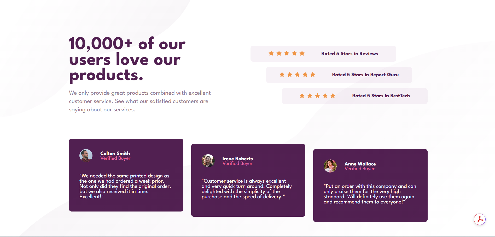

# Frontend Mentor - Social proof section solution

This is a solution to the [Social proof section challenge on Frontend Mentor](https://www.frontendmentor.io/challenges/social-proof-section-6e0qTv_bA). Frontend Mentor challenges help you improve your coding skills by building realistic projects. 

## Table of contents

- [Overview](#overview)
  - [The challenge](#the-challenge)
  - [Screenshot](#screenshot)
  - [Links](#links)
- [My process](#my-process)
  - [Built with](#built-with)
  - [What I learned](#what-i-learned)
  - [Continued development](#continued-development)
  - [Useful resources](#useful-resources)
- [Author](#author)
- [Acknowledgments](#acknowledgments)

## Overview

### The challenge

Users should be able to:

- View the optimal layout for the section depending on their device's screen size

### Screenshot



### Links

- Solution URL: [Add solution URL here](https://your-solution-url.com)
- Live Site URL: [Add live site URL here](https://your-live-site-url.com)

## My process

### Built with

- Semantic HTML5 markup
- CSS custom properties
- Flexbox
- CSS Grid

### What I learned

I learned that the box-sizing property changes how an element’s total size is calculated. If it’s set to content-box (the default), the width and height only apply to the content, so padding and borders make the box bigger than you expect. But if it’s set to border-box, the width and height include padding and borders, which makes sizing stuff way easier.

Here is an example:

```css
* {
    box-sizing: border-box;
    padding: 0;
    margin: 0;
    text-align: center;
    font-family: "League Spartan";
}
```  
I also learned that to bring an element back to the web page after setting it to `display: none;` in a certain screen size, I could use `display: revert;`.

I had to learn to use Git, Github and Markdown for the first time as these would be essential for the submission of the project.

I aim to improve upon writing fewer lines of code to increase efficiency. I also aim to learn and understand best practices when typing code.

### Useful resources

- [chatgpt](https://chatgpt.com/) - This helped me whenever I forgot or needed css code that would perform something I had never learnt on my own. I would not use it to do the code for me but rather I used it as a personal assistant that reminds me whenever I forget then I used my own reasoning to apply what I just learnt or got reminded off. I also used it to learn about Markdown files.  
- [SuperSimpleDev](https://www.youtube.com/watch?v=hrTQipWp6co&t=1837s) - I learnt how to use Git and Github from this youtube channel. 

## Author

- Website - [Add your name here](https://www.your-site.com)
- Frontend Mentor - [@yourusername](https://www.frontendmentor.io/profile/yourusername)

## Acknowledgments

I would like to thank Neo Skhosana for pair programming with me the html. We took turns discussing and typing the semantic structure of the html document. He also taught me about styling using the mobile first approach as its easier to add more complex layout techniques later, rather than starting with complex layouts and later having to remove or readjust them.
